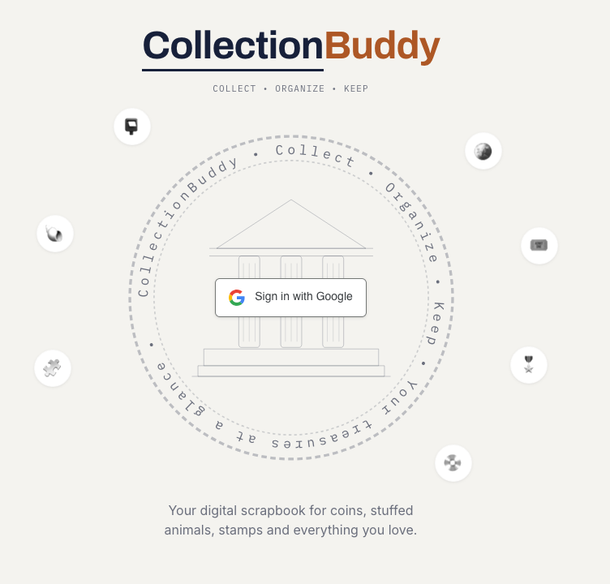
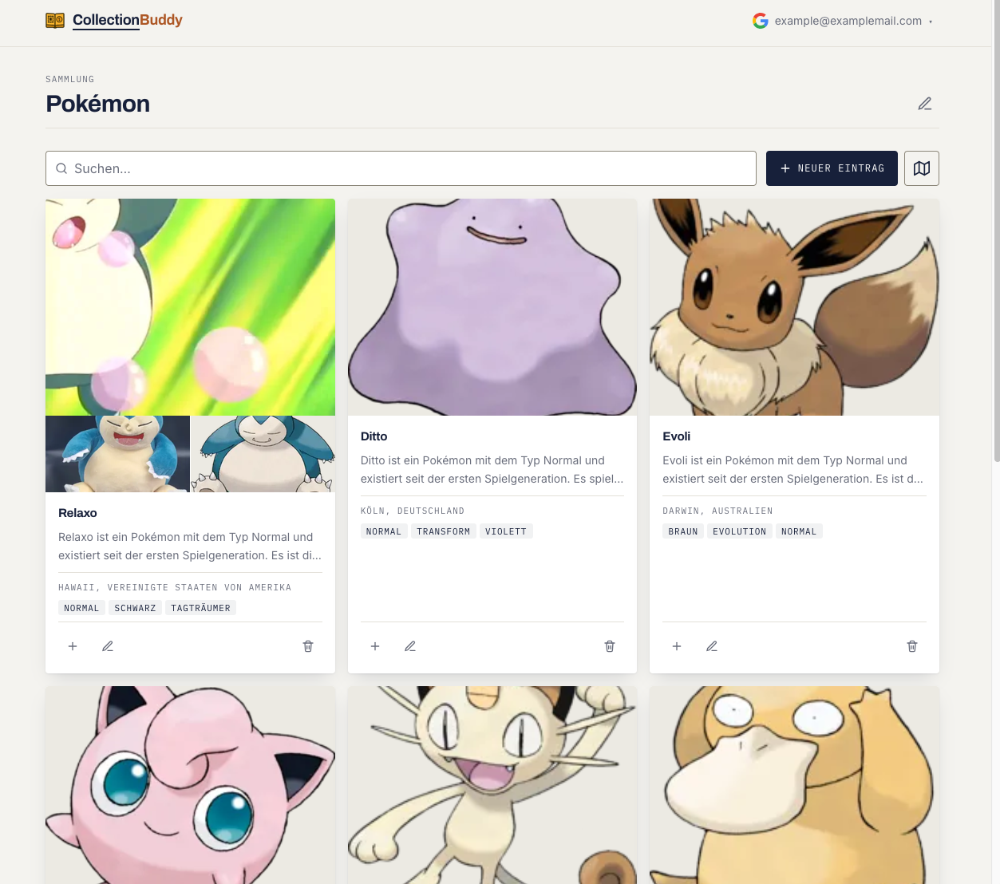
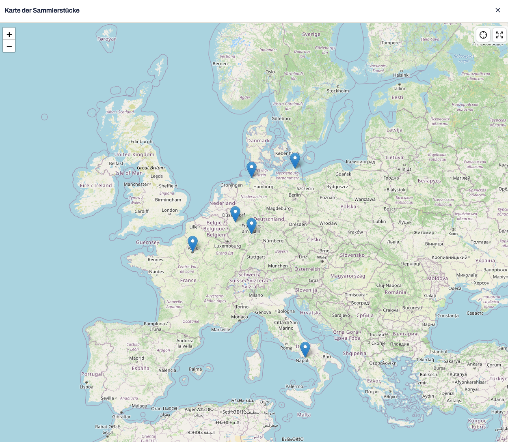

# CollectionBuddy

A web-app catalog for your collected items 🗂️

## Motivation

Spreadsheets don't have room for a photograph, and social apps don't care about provenance. CollectionBuddy is neither: a quiet, photo-first catalog for the things you collect, whether that's coins, stamps, records, or cameras. Every entry leads with a picture, carries a place and a few tags, and stays searchable once the shelf outgrows memory.

| Sign in                                                                                                                            | Your collection                                                                                                                              | Every item on a map                                                                            |
| ---------------------------------------------------------------------------------------------------------------------------------- | -------------------------------------------------------------------------------------------------------------------------------------------- | ---------------------------------------------------------------------------------------------- |
|  |  |  |

## Features

- **Photo-first entries**: one photo, a pair, or a whole strip. Phone photos are compressed to WebP in the browser before upload, so there's no manual resizing.
- **Categories** to keep collections apart, with **sharing** so someone else can browse (read-only) yours.
- **Place and map**: give an item a location, then see your whole collection pinned on a map.
- **Tags and search** across title, description, place, and tags at once.
- **Import/export** a category as a portable archive.
- **Bilingual, themeable**: German/English and light/dark/system, both remembered per visitor.
- Built to work with a keyboard and a screen reader, not just a mouse.
- **Local demo mode**: run a local Supabase stack in Docker and try the app with no Google account or sign-in screen — see [CONTRIBUTING.md](CONTRIBUTING.md#try-the-local-demo).

See the [user guide](docs/how-to/user-guide.md) for the full rundown.

## Documentation

Full docs live in [`docs/`](docs/README.md), organised by [Diátaxis](https://diataxis.fr):

- **Tutorial**: [Getting started](docs/tutorials/getting-started.md)
- **How-to**: [User guide](docs/how-to/user-guide.md) · [Developer guide](docs/how-to/developer-guide.md) (checks, migrations, new environments, deploy)
- **Reference**: [Architecture](docs/reference/architecture.md) · [Configuration](docs/reference/configuration.md)
- **Explanation**: [Design decisions](docs/explanation/design-decisions.md)

## Technology Map

  
  &nbsp;&nbsp;&nbsp;
  
  &nbsp;&nbsp;&nbsp;
  
  &nbsp;&nbsp;&nbsp;
  
  &nbsp;&nbsp;&nbsp;
  
  &nbsp;&nbsp;&nbsp;
  
  &nbsp;&nbsp;&nbsp;
  
  &nbsp;&nbsp;&nbsp;
  
  &nbsp;&nbsp;&nbsp;
  
  &nbsp;&nbsp;&nbsp;
  
  &nbsp;&nbsp;&nbsp;
  
  &nbsp;&nbsp;&nbsp;
  
  &nbsp;&nbsp;&nbsp;
  
  &nbsp;&nbsp;&nbsp;
  
  &nbsp;&nbsp;&nbsp;
  

## Contributing

Contributions are welcome. Whether it's a bug fix, a new feature, or just improving the docs, open an issue or submit a pull request.

Before contributing, please check out [CONTRIBUTING.md](CONTRIBUTING.md) for local setup and the checks CI runs.

## License

This project is licensed under the MIT License.
