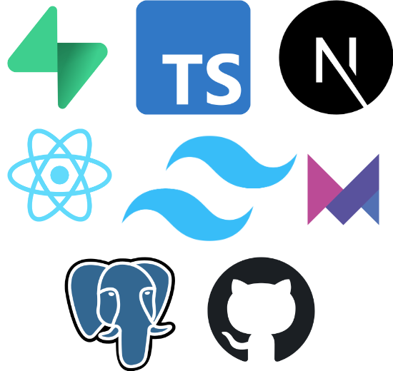

# CollectionBuddy

A web-app catalog for your collected items 🗂️

## Motivation

This project was created to provide a simple and elegant solution for cataloging personal collections. Whether it's stamps, coins, or any other collectible, CollectionBuddy helps you keep track of your items in an organized manner.

## Usage

### Development

CollectionBuddy needs a Supabase backend to run -- see
[CONTRIBUTING.md](CONTRIBUTING.md) for the full local setup, including
starting the local Supabase stack in [`supabase/`](supabase/) and the
Google OAuth credentials it needs. The short version, once that's done:

1.  Navigate to the `web` directory:
    ```bash
    cd web
    ```
2.  Copy the environment template and fill in `NEXT_PUBLIC_SUPABASE_URL` /
    `NEXT_PUBLIC_SUPABASE_ANON_KEY` (the defaults in `web/.env.example`
    match a local `supabase start`):
    ```bash
    cp .env.example .env.local
    ```
3.  Install the dependencies:
    ```bash
    npm install
    ```
4.  Start the development server:
    ```bash
    npm run dev
    ```
    The application will be available at `http://localhost:3000`.

### Building for Production

To build the application for production, run the `build.sh` script from the root directory:

```bash
./build.sh
```

**Note:** A production build requires the `NEXT_PUBLIC_SUPABASE_URL` and `NEXT_PUBLIC_SUPABASE_ANON_KEY` environment variables to be set. These can be obtained from your Supabase project dashboard.

The static files will be generated locally, ready for deployment. The script demonstrates how it's done, but real deployment should happen in your pipeline. 

## Technology Stack

### Frontend

*   **[Next.js](https://nextjs.org/)**: A React framework, used here in **static export mode** (`output: 'export'`) -- there is no server runtime or route handlers, and Server Components only ever render at build time, before any user session exists. See [CONTRIBUTING.md](CONTRIBUTING.md) for what that means for contributors.
*   **[React](https://reactjs.org/)**: A JavaScript library for building user interfaces.
*   **[TypeScript](https://www.typescriptlang.org/)**: A typed superset of JavaScript that compiles to plain JavaScript.
*   **[Tailwind CSS](https://tailwindcss.com/)**: A utility-first CSS framework for rapidly building custom designs.

### Backend

*   **[Supabase](https://supabase.io/)**: An open-source Firebase alternative that provides a suite of tools for building applications, including:
    *   **Authentication**: For managing user sign-ups and logins.
    *   **PostgreSQL Database**: For storing application data.
    *   **Storage**: For managing user-uploaded files, such as images of collected items.

### Deployment

The application is built as a static site and can be deployed on any static hosting service, such as GitHub Pages, Vercel, or Netlify. The `build.sh` script prepares the application for deployment.

## Technology Map



## Contributing

Contributions are welcome! Whether it's a bug fix, new feature, or just improving the docs—open an issue or submit a pull request.

Before contributing, please check out [CONTRIBUTING.md](CONTRIBUTING.md) for local setup and the checks CI runs.

## License

This project is licensed under the MIT License.
