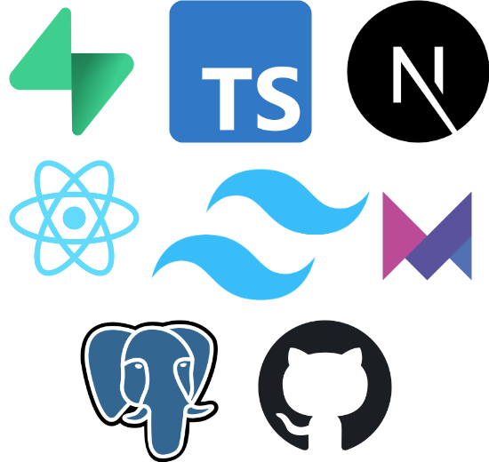

# CollectionBuddy

A web-app catalog for your collected items 🗂️

## Motivation

This project was created to provide a simple and elegant solution for cataloging personal collections. Whether it's stamps, coins, or any other collectible, CollectionBuddy helps you keep track of your items in an organized manner.

## Usage

### Development

To run the application in a development environment, follow these steps:

1.  Navigate to the `web` directory:
    ```bash
    cd web
    ```
2.  Install the dependencies:
    ```bash
    npm install
    ```
3.  Start the development server:
    ```bash
    npm run dev
    ```
    The application will be available at `http://localhost:3000`.

### Building for Production

To build the application for production, run the `build.sh` script from the root directory:

```bash
./build.sh
```

**Note:** A production build requires the `NEXT_PUBLIC_SUPABASE_URL` and `NEXT_PUBLIC_SUPABASE_ANON_KEY` environment variables to be set. These can be obtained from your Supabase project dashboard.

The static files will be generated locally, ready for deployment. The script demonstrates how it's done, but real deployment should happen in your pipeline. 

## Technology Stack

### Frontend

*   **[Next.js](https://nextjs.org/)**: A React framework for building server-side rendered and static web applications.
*   **[React](https://reactjs.org/)**: A JavaScript library for building user interfaces.
*   **[TypeScript](https://www.typescriptlang.org/)**: A typed superset of JavaScript that compiles to plain JavaScript.
*   **[Tailwind CSS](https://tailwindcss.com/)**: A utility-first CSS framework for rapidly building custom designs.
*   **[Framer Motion](https://www.framer.com/motion/)**: A React library for creating animations.

### Backend

*   **[Supabase](https://supabase.io/)**: An open-source Firebase alternative that provides a suite of tools for building applications, including:
    *   **Authentication**: For managing user sign-ups and logins.
    *   **PostgreSQL Database**: For storing application data.
    *   **Storage**: For managing user-uploaded files, such as images of collected items.

### Deployment

The application is built as a static site and can be deployed on any static hosting service, such as GitHub Pages, Vercel, or Netlify. The `build.sh` script prepares the application for deployment.

## Technology Map



## Contributing
Contributions are welcome! Whether it's a bug fix, new feature, or just improving the docs—open an issue or submit a pull request.

Before contributing, please check out our Contributing Guide.

## License
This project is licensed under the MIT License.
